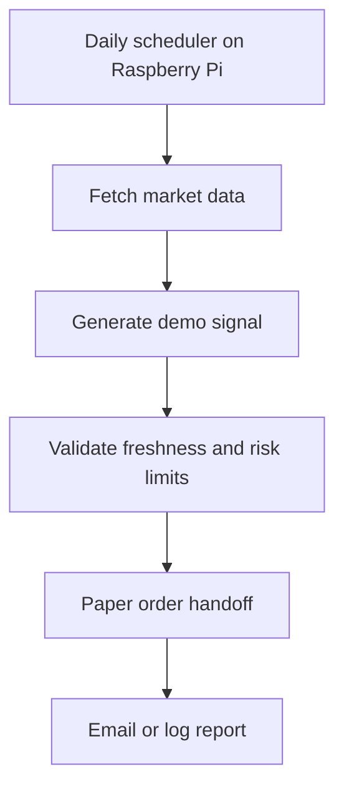

# Architecture

This demo describes a clean public version of the private trading workflow.

## Private Production Version

The private system may contain real broker integrations, model artifacts, optimization outputs, and account-specific configuration. Those pieces are intentionally excluded from this public demo.

## Public Demo Version

The public version keeps only the shape of the pipeline. The included signal generator is a toy example over synthetic data and should not be treated as a trading strategy.
